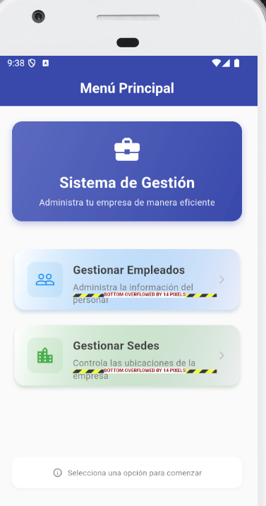
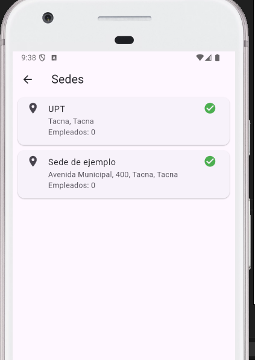

# SM2_EXAMEN_PRACTICO

**Nombre:** Jorge Luis Briceño Diaz  
**Código:** 2017059611  
**Curso:** Soluciones Móviles II  
**Docente:** Dr. Oscar Jimenez  
**Fecha:** 21/05/2025  

---

## 📌 Descripción del Proyecto

Este proyecto forma parte del examen práctico de la Unidad II. A continuación, se presentan dos funcionalidades seleccionadas e implementadas desde el Product Backlog, excluyendo la funcionalidad de Login que está incluida por defecto.

### ✅ Historias de Usuario Implementadas

1. **Gestión de Empleados**  
   _Como administrador quiero ver un listado detallado de empleados con su información básica y estado de activación para gestionar de manera eficiente el personal registrado en el sistema._  
   - **Funcionalidad:** Se implementó una vista dinámica donde el administrador puede visualizar todos los empleados registrados, junto con su nombre, correo electrónico, sede asignada y estado (activo/inactivo). Cada tarjeta de empleado permite acceder rápidamente a opciones de edición o eliminación.

2. **Gestión de Sedes**  
   _Como administrador quiero registrar y gestionar sedes con su nombre, dirección y coordenadas GPS para definir con precisión las ubicaciones donde los empleados pueden registrar su asistencia._  
   - **Funcionalidad:** Se desarrolló una interfaz que muestra el listado completo de sedes registradas. Cada sede incluye detalles como nombre, dirección, coordenadas GPS y estado. Desde esta vista, el administrador puede crear nuevas sedes, editarlas o eliminarlas según sea necesario.

---

## 📷 Capturas de Pantalla

### 1. Funcionalidad: Gestión de Empleados

### 2. Funcionalidad: Gestión de Sedes

---

## 🔗 Enlaces y Referencias

- 🔗 [Repositorio en GitHub](https://github.com/J0rgZ/SM2_EXAMEN_PRACTICO.git)
- 📚 [Documentación oficial de Flutter](https://flutter.dev)
- 📚 [Firebase Documentation](https://firebase.google.com/docs)

---

## 📄 Licencia

Este proyecto fue desarrollado con fines académicos como parte de la evaluación del curso **Soluciones Móviles II**.

---

**© 2025 Jorge Luis Briceño Diaz**

